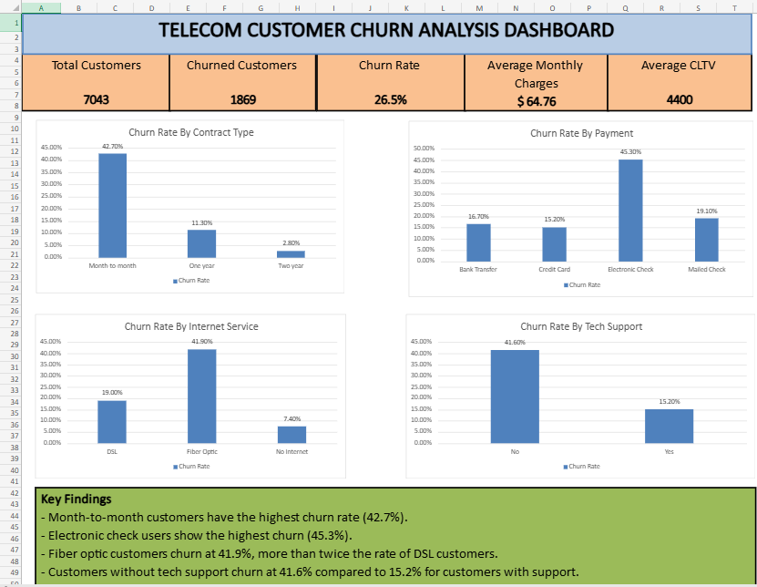

# Telecom Customer Churn Analysis Using Excel

## Overview

Analyzed 7,043 telecom customer records using Excel to identify the primary drivers of customer churn and provide retention recommendations.

## Tools Used

* Microsoft Excel
* Pivot Tables
* Pivot Charts
* Dashboarding

## Dashboard Preview

## Key Findings

* Month-to-month customers had the highest churn rate (42.7%).
* Electronic check users showed the highest churn rate (45.3%).
* Fiber optic customers churned at 41.9%.
* Customers without tech support churned at 41.6%.

## Files

* Telecom Churn Analysis.xlsx
* Telecom Customer Churn Report.pdf

